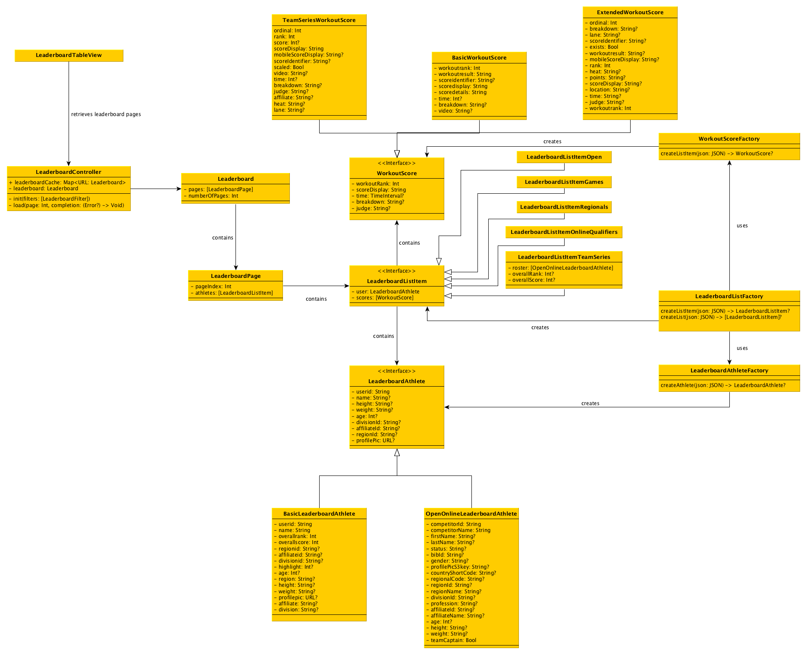

# Leaderboard Responses

The format of leaderboards varies depending on which competition a user is looking at. Current formats encompass:

- The Open
- The Games
- Regionals
- Online Qualifiers
- Team Series

A common format for all leaderboards is to have  pagination information. In general, this pagination information always contains the current page index as well as the total number of pages:

```
"currentpage": 1,
"totalpages": 91
```

## OPEN

### Athletes

```
{
	"userid": "153604",
	"name": "Mathew Fraser",
	"regionid": "11",
	"affiliateid": "2080",
	"divisionid": "1",
	"highlight": 0,
	"age": 27,
	"region": "North East",
	"height": "5'7\"",
	"weight": "190 lb",
	"profilepic": "https://profilepicsbucket.crossfit.com/9e218-P153604_4-184.jpg",
	"overallrank": "1",
	"overallscore": "40",
	"affiliate": "",
	"division": 1,
	"scores": [
		{
			"workoutrank": "20",
			"workoutresult": "--",
			"scoreidentifier": "79865929d2890ec36985",
			"scoredisplay": "10:23",
			"scoredetails": {
				"time": 623,
				"breakdown": "225 reps\nJudged by Matt O'Keefe\nat Champlain Valley CrossFit"
			},
			"video": "0"
		},
		{
			"workoutrank": "15",
			"workoutresult": "--",
			"scoreidentifier": "b41b7a390c967ab0e238",
			"scoredisplay": "222 reps",
			"scoredetails": {
				"time": 654,
				"breakdown": "6 Rounds\n50-ft lunges\n8 Bar MU\n",
				"judge": "Margaux Alvarez",
				"affiliate": "CrossFit Columbus"
			},
			"video": 0
		},
		{
			"workoutrank": "3",
			"workoutresult": "--",
			"scoreidentifier": "72b5ac6ceb59985fbc33",
			"scoredisplay": "17:47",
			"scoredetails": {
				"time": 1067,
				"breakdown": "216 reps",
				"judge": "Todd Widman",
				"affiliate": "Alamo City CrossFit"
			},
			"video": 0
		},
		{
			"workoutrank": "1",
			"workoutresult": "--",
			"scoreidentifier": "09108c63c459551104fe",
			"scoredisplay": "327 reps",
			"scoredetails": {
				"time": 664,
				"breakdown": "1 Round\n55 Deadlifts\n52 Wall-balls",
				"judge": "Jade Jenny",
				"affiliate": "Champlain Valley CrossFit"
			},
			"video": 0
		},
		{
			"workoutrank": "1",
			"workoutresult": "--",
			"scoreidentifier": "7b8e465ac49087bbca1d",
			"scoredisplay": "6:24",
			"scoredetails": {
				"time": 384,
				"breakdown": "440 reps",
				"judge": "Matt O'Keefe",
				"affiliate": "CrossFit Connex"
			},
			"video": 0
		}
	],
	"nextstage": "accepted"
}
```

## GAMES

### Athletes

```
{
	"overallRank": "1",
	"scores": [
		{
			"ordinal": 1,
			"breakdown": "100 pts",
			"lane": 14,
			"scoreIdentifier": "0000",
			"exists": true,
			"workoutresult": "--",
			"mobileScoreDisplay": "28:45.65, 100 pts",
			"rank": "1",
			"heat": 1,
			"points": "100",
			"scoreDisplay": "28:45.65",
			"location": "",
			"time": "28:45.65",
			"judge": "",
			"workoutrank": "1"
		},
		{
			"ordinal": 2,
			"breakdown": "68 pts",
			"lane": 3,
			"scoreIdentifier": "0000",
			"exists": true,
			"workoutresult": "--",
			"mobileScoreDisplay": "23:06.31, 68 pts",
			"rank": "8",
			"heat": 1,
			"points": "68",
			"scoreDisplay": "23:06.31",
			"location": "",
			"time": "23:06.31",
			"judge": "",
			"workoutrank": "8"
		},
		{
			"ordinal": 3,
			"breakdown": "94 pts",
			"lane": 6,
			"scoreIdentifier": "0000",
			"exists": true,
			"workoutresult": "--",
			"mobileScoreDisplay": "8:58.18, 94 pts",
			"rank": "2",
			"heat": 4,
			"points": "94",
			"scoreDisplay": "8:58.18",
			"location": "",
			"time": "8:58.18",
			"judge": "",
			"workoutrank": "2"
		},
		{
			"ordinal": 4,
			"breakdown": "56 pts",
			"lane": 3,
			"scoreIdentifier": "0000",
			"exists": true,
			"workoutresult": "--",
			"mobileScoreDisplay": "12 pt, 56 pts",
			"rank": "12",
			"heat": 8,
			"points": "56",
			"scoreDisplay": "12 pt",
			"location": "",
			"time": "12",
			"judge": "",
			"workoutrank": "12"
		},
		{
			"ordinal": 5,
			"breakdown": "94 pts",
			"lane": 7,
			"scoreIdentifier": "0000",
			"exists": true,
			"workoutresult": "--",
			"mobileScoreDisplay": "202 lb, 94 pts",
			"rank": "2T",
			"heat": 3,
			"points": "94",
			"scoreDisplay": "202 lb",
			"location": "",
			"time": "202",
			"judge": "",
			"workoutrank": "2T"
		},
		{
			"ordinal": 6,
			"breakdown": "56 pts",
			"lane": 10,
			"scoreIdentifier": "0000",
			"exists": true,
			"workoutresult": "--",
			"mobileScoreDisplay": "12:54.73, 56 pts",
			"rank": "12",
			"heat": 2,
			"points": "56",
			"scoreDisplay": "12:54.73",
			"location": "",
			"time": "12:54.73",
			"judge": "",
			"workoutrank": "12"
		},
		{
			"ordinal": 7,
			"breakdown": "52 pts",
			"lane": 7,
			"scoreIdentifier": "0000",
			"exists": true,
			"workoutresult": "--",
			"mobileScoreDisplay": "3:30.64, 52 pts",
			"rank": "14",
			"heat": 3,
			"points": "52",
			"scoreDisplay": "3:30.64",
			"location": "",
			"time": "3:30.64",
			"judge": "",
			"workoutrank": "14"
		},
		{
			"ordinal": 8,
			"breakdown": "72 pts",
			"lane": 6,
			"scoreIdentifier": "0000",
			"exists": true,
			"workoutresult": "--",
			"mobileScoreDisplay": "5:02.72, 72 pts",
			"rank": "7",
			"heat": 4,
			"points": "72",
			"scoreDisplay": "5:02.72",
			"location": "",
			"time": "5:02.72",
			"judge": "",
			"workoutrank": "7"
		},
		{
			"ordinal": 9,
			"breakdown": "100 pts",
			"lane": 6,
			"scoreIdentifier": "0000",
			"exists": true,
			"workoutresult": "--",
			"mobileScoreDisplay": "7:12.44, 100 pts",
			"rank": "1",
			"heat": 4,
			"points": "100",
			"scoreDisplay": "7:12.44",
			"location": "",
			"time": "7:12.44",
			"judge": "",
			"workoutrank": "1"
		},
		{
			"ordinal": 10,
			"breakdown": "94 pts",
			"lane": 5,
			"scoreIdentifier": "0000",
			"exists": true,
			"workoutresult": "--",
			"mobileScoreDisplay": "8:01.40, 94 pts",
			"rank": "2",
			"heat": 4,
			"points": "94",
			"scoreDisplay": "8:01.40",
			"location": "",
			"time": "8:01.40",
			"judge": "",
			"workoutrank": "2"
		},
		{
			"ordinal": 11,
			"breakdown": "88 pts",
			"lane": 10,
			"scoreIdentifier": "0000",
			"exists": true,
			"workoutresult": "--",
			"mobileScoreDisplay": "17:55.26, 88 pts",
			"rank": "3",
			"heat": 2,
			"points": "88",
			"scoreDisplay": "17:55.26",
			"location": "",
			"time": "17:55.26",
			"judge": "",
			"workoutrank": "3"
		},
		{
			"ordinal": 12,
			"breakdown": "52 pts",
			"lane": 5,
			"scoreIdentifier": "0000",
			"exists": true,
			"workoutresult": "--",
			"mobileScoreDisplay": "11:38.24, 52 pts",
			"rank": "14",
			"heat": 4,
			"points": "52",
			"scoreDisplay": "11:38.24",
			"location": "",
			"time": "11:38.24",
			"judge": "",
			"workoutrank": "14"
		},
		{
			"ordinal": 13,
			"breakdown": "68 pts",
			"lane": 5,
			"scoreIdentifier": "0000",
			"exists": true,
			"workoutresult": "--",
			"mobileScoreDisplay": "3:47.99, 68 pts",
			"rank": "8",
			"heat": 4,
			"points": "68",
			"scoreDisplay": "3:47.99",
			"location": "",
			"time": "3:47.99",
			"judge": "",
			"workoutrank": "8"
		}
	],
	"entrant": {
		"status": "ACT",
		"competitorId": 163097,
		"weight": "58 kg",
		"firstName": "Tia-Clair",
		"affiliateName": 13770,
		"profession": 0,
		"gender": "F",
		"age": 23,
		"regionId": "0",
		"regionalCode": "Australia",
		"bibId": "31",
		"height": "163 cm",
		"regionCode": "Australia",
		"competitorName": "Tia-Clair Toomey",
		"teamCaptain": 0,
		"lastName": "Toomey",
		"divisionId": "02",
		"profilePicS3key": "b8a69-P163097_3-184.jpg",
		"affiliateId": 13770
	},
	"ui_info": {
		"highlight": false,
		"drawBlueHR": false
	},
	"overallScore": "994"
}
```

## REGIONALS

### Athletes

```
{
	"overallRank": "1",
	"scores": [
		{
			"ordinal": 1,
			"breakdown": "90 pts",
			"lane": 15,
			"scoreIdentifier": "0000",
			"exists": true,
			"workoutresult": "--",
			"mobileScoreDisplay": "15:20.60, 90 pts",
			"rank": "3",
			"heat": 2,
			"points": "90",
			"scoreDisplay": "15:20.60",
			"location": "",
			"time": "15:20.60",
			"judge": "",
			"workoutrank": "3"
		},
		{
			"ordinal": 2,
			"breakdown": "95 pts",
			"lane": 10,
			"scoreIdentifier": "0000",
			"exists": true,
			"workoutresult": "--",
			"mobileScoreDisplay": "3:19.75, 95 pts",
			"rank": "2",
			"heat": 4,
			"points": "95",
			"scoreDisplay": "3:19.75",
			"location": "",
			"time": "3:19.75",
			"judge": "",
			"workoutrank": "2"
		},
		{
			"ordinal": 3,
			"breakdown": "100 pts",
			"lane": 6,
			"scoreIdentifier": "0000",
			"exists": true,
			"workoutresult": "--",
			"mobileScoreDisplay": "12:34.00, 100 pts",
			"rank": "1",
			"heat": 4,
			"points": "100",
			"scoreDisplay": "12:34.00",
			"location": "",
			"time": "12:34.00",
			"judge": "",
			"workoutrank": "1"
		},
		{
			"ordinal": 4,
			"breakdown": "100 pts",
			"lane": 6,
			"scoreIdentifier": "0000",
			"exists": true,
			"workoutresult": "--",
			"mobileScoreDisplay": "6:21.12, 100 pts",
			"rank": "1",
			"heat": 4,
			"points": "100",
			"scoreDisplay": "6:21.12",
			"location": "",
			"time": "6:21.12",
			"judge": "",
			"workoutrank": "1"
		},
		{
			"ordinal": 5,
			"breakdown": "85 pts",
			"lane": 5,
			"scoreIdentifier": "0000",
			"exists": true,
			"workoutresult": "--",
			"mobileScoreDisplay": "7:22.75, 85 pts",
			"rank": "4",
			"heat": 4,
			"points": "85",
			"scoreDisplay": "7:22.75",
			"location": "",
			"time": "7:22.75",
			"judge": "",
			"workoutrank": "4"
		},
		{
			"ordinal": 6,
			"breakdown": "90 pts",
			"lane": 5,
			"scoreIdentifier": "0000",
			"exists": true,
			"workoutresult": "--",
			"mobileScoreDisplay": "3:26.96, 90 pts",
			"rank": "3",
			"heat": 4,
			"points": "90",
			"scoreDisplay": "3:26.96",
			"location": "",
			"time": "3:26.96",
			"judge": "",
			"workoutrank": "3"
		}
	],
	"entrant": {
		"status": "ACT",
		"competitorId": 16080,
		"countryShortCode": "AUS",
		"weight": "87 lbs",
		"firstName": "James",
		"affiliateName": 5764,
		"profession": 0,
		"gender": "M",
		"age": 26,
		"regionId": 6,
		"regionalCode": "Australia",
		"bibId": 110,
		"height": "177 cm",
		"regionCode": "Australia",
		"competitorName": "James Newbury",
		"teamCaptain": 0,
		"lastName": "Newbury",
		"divisionId": "01",
		"profilePicS3key": "b7c6d-P16080_7-184.jpg",
		"affiliateId": 5764
	},
	"ui_info": {
		"highlight": false,
		"drawBlueHR": false
	},
	"overallScore": "560"
}
```

## ONLINE QUALIFIERS

### Athletes

```
{
	"userid": "733584",
	"name": "Devyn Kim",
	"regionid": "16",
	"affiliateid": "4368",
	"divisionid": "15",
	"highlight": 0,
	"age": 15,
	"region": "Southern California",
	"height": "5'5\"",
	"weight": "135 lb",
	"profilepic": "https://profilepicsbucket.crossfit.com/f7d70-P733584_1-184.jpg",
	"overallrank": "1",
	"overallscore": "23",
	"affiliate": "",
	"division": 15,
	"scores": [
		{
			"workoutrank": "1",
			"workoutresult": "--",
			"scoreidentifier": "6a1c836ba9b8b8bba5e9",
			"scoredisplay": "1",
			"scoredetails": { },
			"video": "0"
		},
		{
			"workoutrank": "1",
			"workoutresult": "--",
			"scoreidentifier": "7036c18d302aa46e1e82",
			"scoredisplay": "262 reps",
			"scoredetails": {
				"time": 915,
				"breakdown": "100 DB Snatches\n80 Calories\n60 Burpees\n22 Muscle-ups",
				"judge": "Wayne Kim",
				"affiliate": "CrossFit by Overload"
			},
			"video": 0
		},
		{
			"workoutrank": "7",
			"workoutresult": "--",
			"scoreidentifier": "fd0ab100f46dc75170be",
			"scoredisplay": "17:53",
			"scoredetails": {
				"time": 1073,
				"breakdown": "430 reps",
				"judge": "Aaron Hunter",
				"affiliate": "CrossFit by Overload"
			},
			"video": 0
		},
		{
			"workoutrank": "9",
			"workoutresult": "--",
			"scoreidentifier": "bb8a7e3a60057d3f29d9",
			"scoredisplay": "2:46",
			"scoredetails": {
				"time": 166,
				"breakdown": "",
				"judge": "Wayne Kim",
				"affiliate": "CrossFit by Overload"
			},
			"video": 0
		},
		{
			"workoutrank": "5",
			"workoutresult": "--",
			"scoreidentifier": "d716ce9a36419840e1c5",
			"scoredisplay": "4:27",
			"scoredetails": {
				"time": 267,
				"breakdown": "",
				"judge": "Aaron Hunter",
				"affiliate": "CrossFit by Overload"
			},
			"video": 0
		}
	],
	"nextstage": "accepted"
}
```

## TEAM SERIES

### Athletes

```
{
	"entrant": {
		"competitorId": "7859",
		"competitorName": "Training Think Tank",
		"firstName": "",
		"lastName": "",
		"status": "ACT",
		"bibId": "",
		"gender": "MM",
		"profilePicS3key": "",
		"countryShortCode": "",
		"regionalCode": "1",
		"regionId": "15",
		"regionName": "South East",
		"divisionId": "11",
		"profession": "0",
		"affiliateId": "7104",
		"affiliateName": "",
		"age": "All",
		"height": "",
		"weight": "",
		"teamCaptain": "0"
	},
	"ui": {
		"highlight": false
	},
	"roster": [
		{
			"competitorId": "1690",
			"competitorName": "Travis Mayer",
			"firstName": "Travis",
			"lastName": "Mayer",
			"status": "ACT",
			"bibId": "",
			"gender": "M",
			"profilePicS3key": "9de68-P1690_5-184.jpg",
			"countryShortCode": "US",
			"regionalCode": "1",
			"regionId": "15",
			"regionName": "South East",
			"divisionId": "11",
			"profession": "0",
			"affiliateId": "7104",
			"affiliateName": "",
			"age": "26",
			"height": "71 in",
			"weight": "195 lb",
			"teamCaptain": "1"
		},
		{
			"competitorId": "2725",
			"competitorName": "Noah Ohlsen",
			"firstName": "Noah",
			"lastName": "Ohlsen",
			"status": "ACT",
			"bibId": "",
			"gender": "M",
			"profilePicS3key": "0a0bc-P2725_5-184.jpg",
			"countryShortCode": "",
			"regionalCode": "1",
			"regionId": "15",
			"regionName": "South East",
			"divisionId": "11",
			"profession": "0",
			"affiliateId": "7104",
			"affiliateName": "",
			"age": "26",
			"height": "67 in",
			"weight": "195 lb",
			"teamCaptain": "0"
		}
	],
	"scores": [
		{
			"ordinal": 1,
			"rank": "8",
			"score": "10431780",
			"scoreDisplay": "3:40",
			"mobileScoreDisplay": "",
			"scoreIdentifier": "d2a5c5cb25837f7526d8",
			"scaled": "0",
			"video": "0",
			"time": 220,
			"breakdown": "",
			"judge": "Max El",
			"affiliate": "CrossFit Passion",
			"heat": "",
			"lane": ""
		},
		{
			"ordinal": 2,
			"rank": "4",
			"score": "17200271",
			"scoreDisplay": "10:29",
			"mobileScoreDisplay": "",
			"scoreIdentifier": "970adb4d8b63663ab18a",
			"scaled": "0",
			"video": "0",
			"time": 629,
			"breakdown": "720 reps",
			"judge": "Max El",
			"affiliate": "CrossFit Passion",
			"heat": "",
			"lane": ""
		},
		{
			"ordinal": 3,
			"rank": "2",
			"score": "12100286",
			"scoreDisplay": "7:14",
			"mobileScoreDisplay": "",
			"scoreIdentifier": "5da5299718934b9afc80",
			"scaled": "0",
			"video": "0",
			"time": 434,
			"breakdown": "210 reps",
			"judge": "Max El",
			"affiliate": "CrossFit Passion",
			"heat": "",
			"lane": ""
		},
		{
			"ordinal": 4,
			"rank": "5",
			"score": "10431693",
			"scoreDisplay": "5:07",
			"mobileScoreDisplay": "",
			"scoreIdentifier": "a14f6cd607285d25de82",
			"scaled": "0",
			"video": "0",
			"time": 307,
			"breakdown": "",
			"judge": "Max El",
			"affiliate": "CrossFit Passion",
			"heat": "",
			"lane": ""
		},
		{
			"ordinal": 5,
			"rank": "1",
			"score": "11750000",
			"scoreDisplay": "175 reps",
			"mobileScoreDisplay": "",
			"scoreIdentifier": "3fe11835b35ffd7424f4",
			"scaled": "0",
			"video": "0",
			"breakdown": "Round of 21 +\n7 Burpees",
			"judge": "Max El",
			"affiliate": "CrossFit Passion",
			"heat": "",
			"lane": ""
		},
		{
			"ordinal": 6,
			"rank": "9",
			"score": "10901469",
			"scoreDisplay": "5:31",
			"mobileScoreDisplay": "",
			"scoreIdentifier": "14453641283e118b8ee7",
			"scaled": "0",
			"video": "0",
			"time": 331,
			"breakdown": "90 reps",
			"judge": "Max El Hag",
			"affiliate": "CrossFit Passion",
			"heat": "",
			"lane": ""
		},
		{
			"ordinal": 7,
			"rank": "4",
			"score": "10001496",
			"scoreDisplay": "1496 reps",
			"mobileScoreDisplay": "",
			"scoreIdentifier": "325d4ebe3a2f38c9d11e",
			"scaled": "0",
			"video": "0",
			"breakdown": "Travis Mayer\nHandstand push-ups: 76 reps\nDouble-unders: 217 reps\nBack squat: 432 lb\n\nNoah Ohlsen\nBack squat: 462 lb\nDouble-unders: 247 reps\nHandstand push-ups: 62 reps\n",
			"judge": "Brannen Dorman",
			"affiliate": "CrossFit Passion",
			"heat": "",
			"lane": ""
		},
		{
			"ordinal": 8,
			"rank": "1",
			"score": "10431379",
			"scoreDisplay": "10:21",
			"mobileScoreDisplay": "",
			"scoreIdentifier": "14644fac74e46dc06aba",
			"scaled": "0",
			"video": "0",
			"time": 621,
			"breakdown": "05:13 - Travis Mayer\n05:08 - Noah Ohlsen",
			"judge": "Max El",
			"affiliate": "CrossFit Passion",
			"heat": "",
			"lane": ""
		}
	],
	"overallRank": "1",
	"overallScore": "34",
	"nextStage": ""
}
```

# Common format:

## Open & Online qualifiers - User information
```
	"userid": "153604",
	"name": "Mathew Fraser",
	"regionid": "11",
	"affiliateid": "2080",
	"divisionid": "1",
	"highlight": 0,
	"age": 27,
	"region": "North East",
	"height": "5'7\"",
	"weight": "190 lb",
	"profilepic": "https://profilepicsbucket.crossfit.com/9e218-P153604_4-184.jpg",
	"overallrank": "1",
	"overallscore": "40",
	"affiliate": "",
	"division": 1,
```

- First & last name not separate values
- Gender only indirectly indicated via division
- Age, height & weight can be empty if showing a team.

## Games, Regionals & Team Series - User information

```
	"entrant": {
		"competitorId": "7859",
		"competitorName": "Training Think Tank",
		"firstName": "",
		"lastName": "",
		"status": "ACT",
		"bibId": "",
		"gender": "MM",
		"profilePicS3key": "",
		"countryShortCode": "",
		"regionalCode": "1",
		"regionId": "15",
		"regionName": "South East",
		"divisionId": "11",
		"profession": "0",
		"affiliateId": "7104",
		"affiliateName": "",
		"age": "All",
		"height": "",
		"weight": "",
		"teamCaptain": "0"
	}
```

- Competitor name can be a team name.
- First & last name can be empty
- Information bundled for multiple competitors. Age can be something like "All"

## Implementation

For displaying a whole leaderboard, one or more pages for a leaderboard request have to be loaded. In order to download pages as the user scrolls through the list (or to download the first page), a `LeaderboardController` is initialized with leaderboard filters, which can be translated into a URL to load leaderboard JSON.

Given the JSON response, the leaderboard that is maintained by the `LeaderboardController` is populated with an additional `LeaderboardPage`. A `LeaderboardPage` is created by reading basic page information (such as page index and total number of pages) from JSON directly. As the competitior list format of the JSON can vary between different competitions, a `LeaderboardListFactory` is used to create this list based on what `LeaderboardListItem` types it can parse. In order to further distribute the responsibility of then parsing the different `LeaderboardAthlete` and `WorkoutScore` types contained within a `LeaderboardListItem`, separate factory classes are used to infer those.

As users look up different leaderboards, `LeaderboardController` also maintains a cache for any previously loaded leaderboards (cached with the request URL and without `?page=X` information), limited to a certain number of bytes or leaderboards in order to keep the memory footprint low. This allows prompt fetching of previously loaded leaderboard pages without the need of performing the same network requests again.

