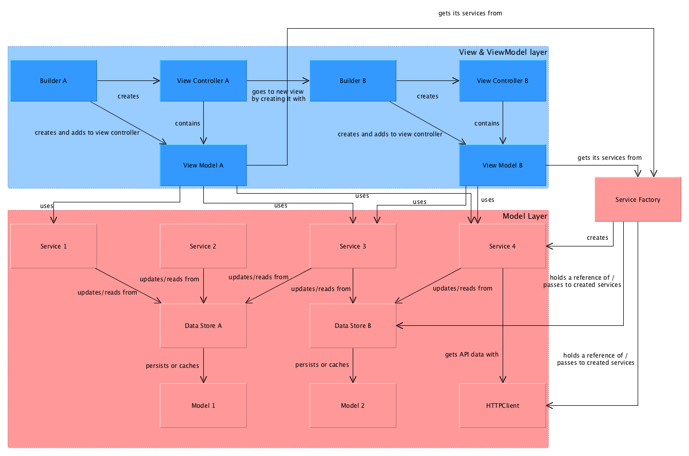

# CrossFit Games

## Purpose
Build a native iOS experience for CrossFitters to keep track of their workout progress and see how they compete 
with other players.

## Authors

### iOS
- Daniel Vancura
- Malinka Seneviratne

### Project Management
- Alexandra Marchesano

## iOS Specificities

### Install/Build Notes
* Clone repo
* Request `keys` file from project admin and add to root directory of project
	* `keys` file should **NEVER** be tracked via git
	* `keys` file contains a list of keys app requires to communicate with APIs and other third party dependecies
* install pods (`pod install`)
* If Crashlytics isn't installed on your computer yet:
  * Go to crashlytics.com, 
  * Install Xcode plugin, 
  * Select 'app already setup' when asked, 
  * Compile project, you are all set!

### Dev Notes
- Swift Version & Xcode
    - This app requires Xcode 9 and Swift 4 for development.

### App Architecture
**Disclosure** The following code snippets are just examples and are not present in the app.



#### App Architecture Part 1: MVVM
In a broad sense the app architecture is MVVM (Model View View-Model) with certain additional 
considerations to allow for code reusability and modularity. While MVVM solves for the problem of 
"Massive View Controllers", it is easy to run into the issue of creating "Massive View Models" instead, 
as the problem of having a "god classes" is only shifted to a different location but not quite
resolved.

#### App Architecture Part 2: Service
In order to limit the responsibility of view models, any interaction on models is performed through
services. Reason for this intermediate layer is code reusability: In a scenario where we have to
retrieve leaderboard information on two different view controllers for example, both view controllers
might need to fire network requests to fetch that information and then save it to some local data store.
By creating an intermediate service (or data manager in other words), we make this particular logic
reusable and potentially cacheable:

We create a `LeaderboardService` that might look similar to this:

```swift
struct LeaderboardService {
  let leaderboardDataStore: LeaderboardDataStore
  let httpClient: HTTPClient
  
  /// Gets the leaderboard from the API or, in case it has previously been downloaded, from the locally
  /// cached information.
  func getLeaderboard(completion: @escaping (Leaderboard?, Error?) -> Void) -> Leaderboard? {
    if let existing = leaderboardDataStore.leaderboard {
      return existing
    } else {
      let afRequest = Alamofire.request(...)
      httpClient.perform(afRequest, completion: { json, error in
        completion(Leaderboard(json: json), error)
      })
    }
  }
}
```

#### App Architecture Part 3: ServiceFactory
We now want to be able to create services from everywhere in the app. For this purpose we use a factory 
pattern to create services with injected dependencies. For instance, in the example above, we still need
`leaderboardDataStore` and `httpClient`, both of which should be shared instances throughout the app:

- we always want to access the same data stores, no matter where in the app we are
- we want our HTTP client(s) to handle authentication and request queueing on their own, regardless of
  which service uses them.

By using a factory pattern as mentioned, we can create a singleton instance that handles all these
standalone objects in one consistent place:

```swift
struct ServiceFactory {
  static let shared = ServiceFactory()
  
  private let httpClient: HTTPClient
  private let leaderboardDataStore: LeaderboardDataStore
  
  private init() {
    httpClient = HTTPClient()
    leaderboardDataStore = LeaderboardDataStore()
  }
  
  /// Creates a leaderboard data store for any view model that needs it.
  public func createLeaderboardService() -> LeaderboardService {
    return LeaderboardService(leaderboardDataStore: self. leaderboardDataStore,
                              httpClient: self.httpClient)
  }
}
```

#### App Architecture Part 4: View Model
View models user aforementioned services to get any information they need from either a local data store
or from the API. Furthermore, they are the only interface to their matching view controller to get information.
An example view model might look like this and can use as many different services as it needs to get the
data it needs to fulfill its view controller's contract:

```swift
struct MyViewModel {
  let leaderboardService: LeaderboardService
  let userInfoService: UserInfoService
  let userRegistrationService: UserRegistrationService
  
  var userName: String {
    return userInfoService.user.name
  }
  
  var leaderboardFilters: [String] {
    return leaderboardService.getLeaderboard(completion: {_ in})?.filters
      .map {
        $0.value
      } ?? []
  }
  
  init() {
    leaderboardService = ServiceFactory.shared.createLeaderboardService()
    userInfoService = ServiceFactory.shared.createUserInfoService()
    userRegistrationService = ServiceFactory.shared.createUserRegistrationService()
  }
  
  func registerUser(name: String, completion: @escaping (Error?) -> Void) {
    userRegistrationService.register(userName: name) { error in
      completion(error)
    }
  }
}
```

To reiterate on this: any business logic (such as registering a user, getting user information, getting 
leaderboard information) is captured through individual services. This way the view model source code
becomes smaller, easier to maintain and test and bugs become easier traceable & fixable when happening 
within a service.

#### App Architecture Part 5: Model
In part we already mentioned this layer already: `LeaderboardDataStore` is an example of the essential
model layer. Data stores are classes that maintain information about any local model information such as
downloaded leaderboards, locally saved user information, ...

Each data store also acts on its own. For example, a `UserInfoDataStore` could be a data store that
saves user information solely encrypted in the keychain, while `LeaderboardDataStore` might use core data
to persist its information.

#### App Architecture Part 6: Builder
Given a view controller, its view model and a couple of services, the question remains how to put pieces
together. For a view model to get any services it needs, it can just call `ServiceFactory.shared.create...`
to retrieve them. View controller's on the other hand need to be created from storyboards and don't
have anything like a `ViewModelFactory` to get their view models from. Instead, a simple builder pattern
is used to create a view controller and inject it with its view model:

```swift
protocol Builder {
  func build() -> UIViewController
}

struct MyBuilder: Builder {
  func build() -> UIViewController {
    guard let viewController = UIStoryboard(name: "MyStoryboard", bundle: nil).instantiateInitialViewController() as? MyViewController else {
      return nil
    }
    viewController.viewModel = MyViewModel()
    return viewModel
  }
}

// Example usage: self.navigationController?.push(MyBuilder().build(), animated: true)
```

The benefit of this is that you can create a view controller from anywhere in the app without having
to pass information from previous view controllers and thereby make view controllers independent from
each other. In cases where additional information needs to be passed, it can be added as a variable to
the builder. A common example for this would be a product page for a specific product, where we can
pass the view model directly:

```swift
struct ProductPageBuilder: Builder {
  let productViewModel: ProductPageViewModel
  
  func build() -> UIViewController {
    guard let viewController = UIStoryboard(name: "ProductPageStoryboard", bundle: nil).instantiateInitialViewController() as? ProductPageViewController else {
      return nil
    }
    viewController.viewModel = productViewModel
    return viewModel
  }
}

// Example usage: self.navigationController?.push(MyBuilder(productPageViewModel: ProductPageViewModel(productId: 123)).build(), animated: true)
```

#### App Architecture: Do's and dont's
* View controllers should get all the information they need from a view model but _not from a model_!

  *DO:*

```swift
  class MyViewController: UIViewController {
    @IBOutlet private weak var userNameLabel!
    
    var viewModel: MyViewModel
    
    override func viewDidLoad() {
      super.viewDidLoad()
      userNameLabel.text = viewModel.userName
    }
```

  *DON'T:*

```swift
  class MyViewController: UIViewController {
    @IBOutlet private weak var userNameLabel!
    
    var viewModel: MyViewModel
    
    override func viewDidLoad() {
      super.viewDidLoad()
      userNameLabel.text = viewModel.user.name
    }
```

  The idea is to be able to change the model without having to touch any view controllers.

* Serivces are supposed to serve business logic for any task (about the model) - not just for one view 
  model or view (about the view)
  
  *DO:*
  
```swift
  /// Serves information about the user
  struct UserInfoService { ... }
  
  /// Service to create new users
  struct UserRegistrationService { ... }
```
  
  *DON'T:*
  
```swift
  /// Serves information for the product page
  struct ProductPageService { ... }
  
  /// Service for the login screen
  struct LoginViewService { ... }
```

#### Loading leaderboards

Documentation for this can be found [here](./Documentation/LeaderboardList/Leaderboard Responses.md).

### Analytics

Analytics tags can be found [here](https://docs.google.com/spreadsheets/d/1YNMHivTpGmaxb6uHoi1bp8gu17CWeMsx2Gc9UZFt1rg).

The main interface to log analytics tags is via the Open Source framework [Simcoe](https://github.com/prolificinteractive/simcoe). Simcoe allows a simple way to perform Analytics tagging with any provider and using a unified interface to do so. An example for instantiating Simcoe is `Simcoe.run(with: [Adobe()])`. With the `run` method called, any tags sent to Simcoe will be logged through Adobe. Changing this call to `Simcoe.run(with: [MixpanelPlaceholder()])` with the Simcoe Mixpanel subspec for example would require no changes in the codebase and still log all Analytics tags as before, now through Mixpanel.

The following steps are to be followed when logging anything for Analytics:

* Import Simcoe in your class

```swift
import Simcoe
```

* User information is captured in a `UserAnalyticsProperties` struct. This struct can be created from its raw values and analytics information can be sent via

```swift
Simcoe.setUserAttributes(UserAnalyticsProperties(...).rawValue)
```

* User information can also be updated with single property values:

```swift
Simcoe.setUserAttribute(.userName, value: "Pukey")
```

* All keys, event names and screens are to be added to `AnalyticsKey` in their individual enums:

```swift
struct AnalyticsKey {

    enum Event: String {
        ... // All events in the app
    }

    enum Property: String {
        ... // All property keys in the app
    }
    
    enum Screen: String {
        ... // All possible values for analytics key "screen" in the app
    }

}
```

Extension functions for Simcoe allow the use of those values directly, meaning in the above example, `Simcoe.setUserAttribute(.userName, value: "Pukey")` can be used instead of `Simcoe.setUserAttribute(AnalyticsKey.Property.userName.rawValue, value: "Pukey")`. As values for properties can vary widely, they are not captured in any enum but declared directly in code (like `"Pukey"` in this example). An exception to this are screens, which have an individual `Screen` enum within `AnalyticsKey` as they are heavily reused throughout analytics events.

#### Usage Example

Capturing event `Dashboard Card Expanded` from [the Analytics document](https://docs.google.com/spreadsheets/d/1YNMHivTpGmaxb6uHoi1bp8gu17CWeMsx2Gc9UZFt1rg/edit#gid=1442657975) with the track call `(Dashboard Card Expanded, {Dashboard Card: <dashboard card name>, screen: 'Dashboard'})`:

1. `import Simcoe` in the class where you want to make the track call.
2. Add `case dashboardCardExpanded = "Dashboard Card Expanded"` to `AnalyticsKey.Event`
3. Add `case dashboardCard = "Dashboard Card"` to `AnalyticsKey.Property` (unless it already exists)
4. Add `case dashboard = "Dashboard"` to `AnalyticsKey.Screen` (unless it already exists)
5. Make your track call: `Simcoe.track(event: .dashboardCardExpanded, withAdditionalProperties: [.dashboardCard: "<Some Dashboard Card Name>"], on: .dashboard)`

#### Limitations

- Analytics tracking is performed through Firebase. The Firebase SDK only accepts numeric and string values.

### Cocoapods
This project relies on [cocoapods](cocapods.org) to manage its dependencies

### jazzy
* This project uses jazzy to extract documentation from Swift code.
* [GitHub Repo](https://github.com/realm/jazzy)
  